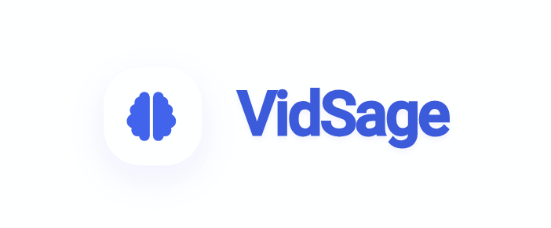
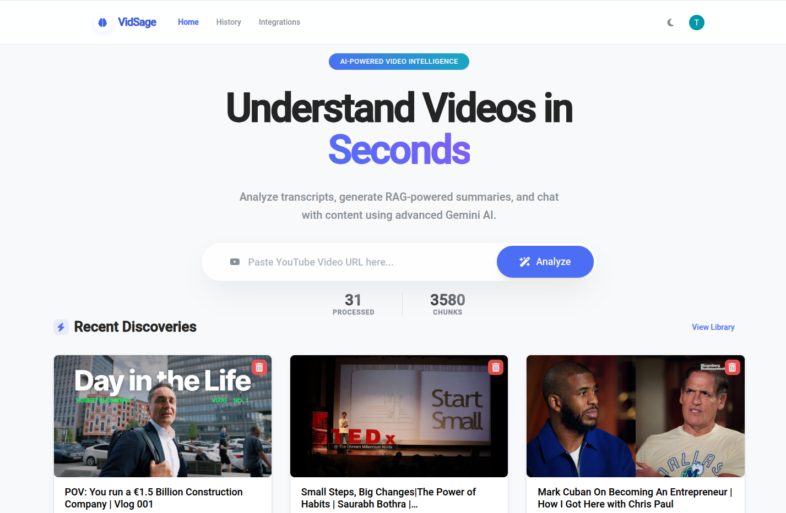
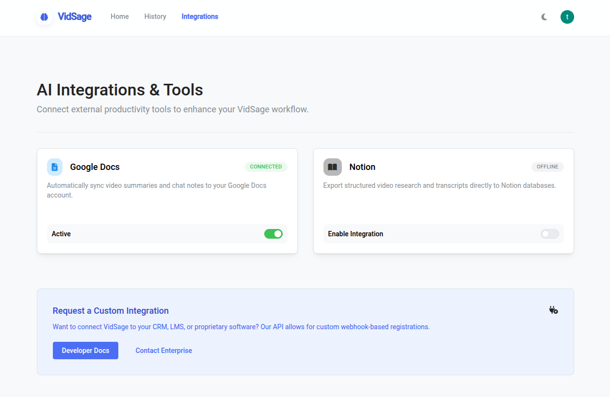
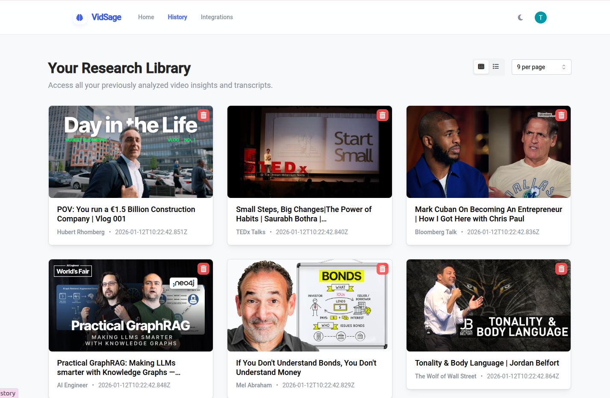
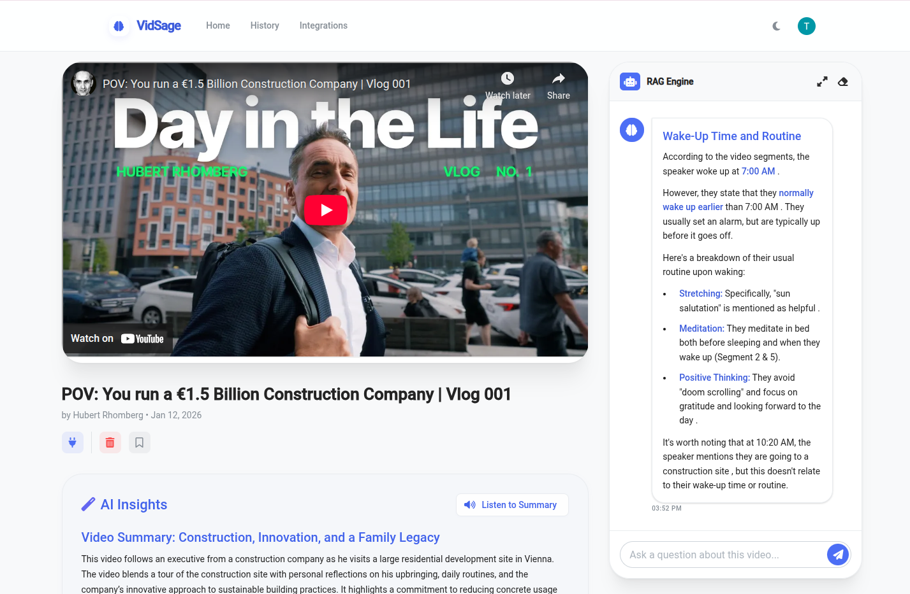
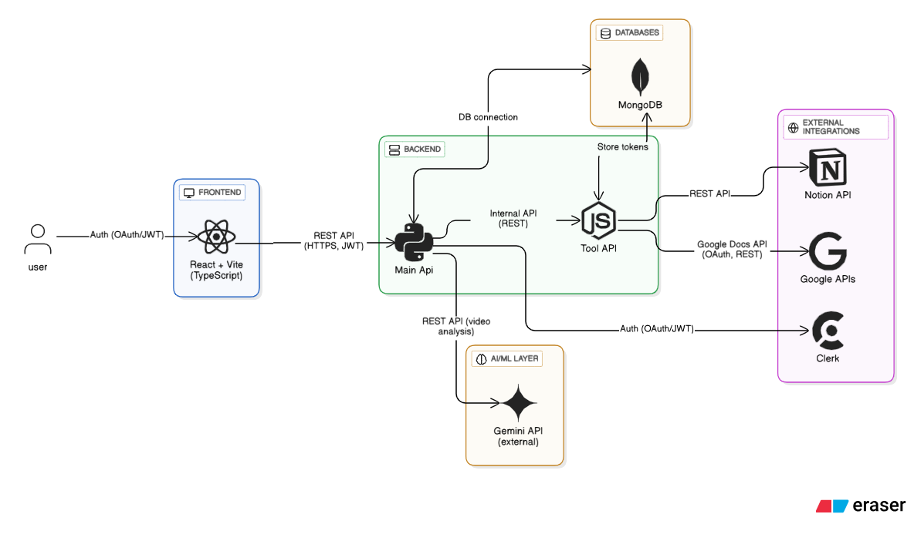

# VidSage

  

  <b>AI-powered Video Insights Platform</b> 
  <i>Unlock knowledge from videos with advanced search, summarization, and more.</i>

## 🚀 Overview

**VidSage** is a full-stack, production-grade application designed to extract, analyze, and interact with video content using state-of-the-art AI. Built as a portfolio project, VidSage demonstrates expertise in modern web development, scalable backend architecture, and seamless AI integration.

  
  
  
  
  
  
  
  
  
  
  
  
  
  
  

## ✨ Features

### 🌟 What You Can Do with VidSage

- **Instant YouTube Video Summaries**: Paste any YouTube link and get a concise, AI-powered summary of the video content in seconds.
- **Listen to Summaries**: Prefer audio? Instantly listen to the generated video summaries for hands-free insights.
- **Ask Anything About a Video**: Chat with your videos! Ask questions and get smart, context-aware answers based on the video’s content.
- **Multi-Video Q&A**: Select multiple videos and ask questions that span across all their content for deep research and comparison.
- **Integrate with Your Favorite Tools**: Connect Google Drive and Notion to save summaries, research, and transcripts directly to your productivity apps.
- **Save & Revisit Your History**: All your processed videos and Q&A sessions are saved in your personal research library for easy access anytime.
- **Modern, Intuitive UI**: Enjoy a sleek, responsive interface designed for productivity and ease of use.

---

## 🖼️ Screenshots

<table align="center">
  <tr>
    <td align="center">
      
       <b>Home Dashboard</b>
    </td>
    <td align="center">
      
       <b>AI Integrations & Tools</b>
    </td>
  </tr>
  <tr>
    <td align="center">
      
       <b>Research Library</b>
    </td>
    <td align="center">
      
       <b>Video Detail & Insights</b>
    </td>
  </tr>
</table>

---

## 🏗️ Architecture

  

- **Frontend**: React, TypeScript, Vite, Tailwind CSS
- **Backend**: FastAPI (Python), Node.js (Express), MongoDB & MySQL, Docker
- **AI/ML**: Gemini API, RAG (Retrieval-Augmented Generation) using LangChain
- **Authentication**: Clerk/Auth0 
- **Deployment**: Azure Container Apps & App Service

---

## 🛠️ Best Practices & Engineering Highlights

- **Microservices**: Modular FastAPI backend, clear separation of concerns
- **Type Safety**: TypeScript (frontend), Pydantic (backend)
- **DevOps**: Docker, environment configs, easy cloud/local deploy
- **Testing**: Automated unit & integration tests
- **CI/CD**: Automated build, test, deploy
- **AI**: Gemini API, LangChain RAG integration
- **OpenAPI**: Auto-generated docs & contracts
- **Security**: JWT, CORS, input validation, rate limiting
- **Performance**: Async, caching, vector search
- **Extensible**: Clean, pluggable codebase

> VidSage is engineered for reliability, scalability, and developer productivity—making it easy to extend, maintain, and deploy in real-world scenarios.

---

## 🌐 Live Demo

> [https://vidsage.com](https://vidsage-yt.web.app)

---

## 📚 API Documentation

- **Main API (Video Processing, Summaries, Q&A):**
  - Swagger/OpenAPI: [http://localhost:8000/docs](http://localhost:8000/docs)

- **Tool Integration API (User Management, Google OAuth/Docs):**
  - Swagger/OpenAPI: [http://localhost:4000/docs](http://localhost:4000/docs)
  - OpenAPI YAML: [`backend/tool-integration/openapi.yaml`](backend/tool-integration/openapi.yaml)
