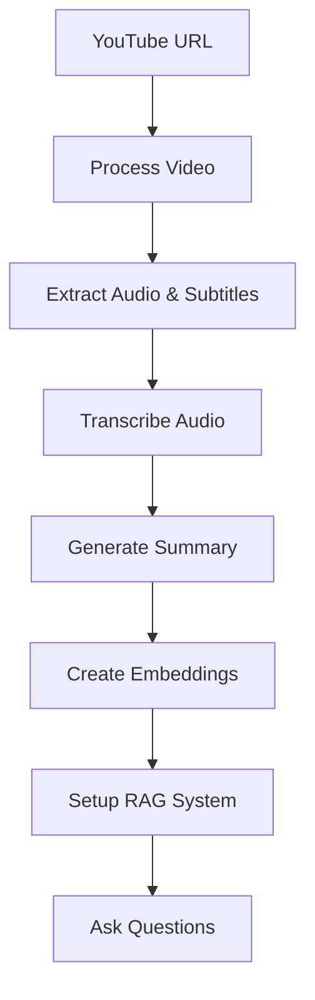

# VidSage API Documentation 🎥

## Overview

VidSage API is a comprehensive REST API for YouTube video analysis powered by AI. It provides endpoints for video processing, transcription, summarization, and intelligent Q&A using Retrieval-Augmented Generation (RAG).

## 🚀 Quick Start

### Installation

1. **Clone the repository:**
```bash
git clone <repository-url>
cd VidSage
```

2. **Install dependencies:**
```bash
pip install -r requirements.txt
```

3. **Set up environment variables:**
```bash
# Create .env file
echo "GOOGLE_API_KEY=your_google_api_key_here" > .env
```

4. **Start the API server:**
```bash
# Using uvicorn directly
uvicorn api.main:app --host 0.0.0.0 --port 8000 --reload

# Or using Python module
python -m uvicorn api.main:app --host 0.0.0.0 --port 8000 --reload
```

5. **Access the documentation:**
- **Swagger UI:** http://localhost:8000/docs
- **ReDoc:** http://localhost:8000/redoc
- **Health Check:** http://localhost:8000/health

## 📋 Prerequisites

- **Python 3.8+**
- **Google API Key** for Gemini AI (required for summarization and RAG)
- **FFmpeg** (for audio processing)
- **Git** (for cloning repository)

## 🔧 Configuration

### Environment Variables

Create a `.env` file in the project root:

```bash
# Required
GOOGLE_API_KEY=your_google_gemini_api_key

# Optional
DATA_DIR=./data                    # Data storage directory
WHISPER_MODEL=base                 # Whisper model (tiny, base, small, medium, large)
CHUNK_SIZE=500                     # Text chunk size for RAG
CHUNK_OVERLAP=100                  # Text chunk overlap for RAG
```

### API Key Setup

1. **Get Google API Key:**
   - Go to [Google AI Studio](https://aistudio.google.com/)
   - Create a new API key
   - Enable Gemini API access

2. **Set the API key:**
```bash
export GOOGLE_API_KEY="your_api_key_here"
```

## 🎯 Core Workflow

### Basic Video Processing Workflow



### API Call Sequence

1. **Process Video:**
```bash
curl -X POST "http://localhost:8000/videos/process" \
  -H "Content-Type: application/json" \
  -d '{"url": "https://www.youtube.com/watch?v=VIDEO_ID"}'
```

2. **Transcribe Audio:**
```bash
curl -X POST "http://localhost:8000/videos/{video_id}/transcribe" \
  -H "Content-Type: application/json" \
  -d '{"video_id": "VIDEO_ID", "model_name": "base"}'
```

3. **Generate Summary:**
```bash
curl -X POST "http://localhost:8000/videos/{video_id}/summarize" \
  -H "Content-Type: application/json" \
  -d '{"video_id": "VIDEO_ID", "summary_type": "default"}'
```

4. **Setup RAG System:**
```bash
curl -X POST "http://localhost:8000/videos/{video_id}/setup-rag"
```

5. **Ask Questions:**
```bash
curl -X POST "http://localhost:8000/videos/{video_id}/ask" \
  -H "Content-Type: application/json" \
  -d '{"video_id": "VIDEO_ID", "question": "What is this video about?"}'
```

## 📚 API Endpoints

### Video Processing

| Endpoint | Method | Description |
|----------|--------|-------------|
| `/videos/process` | POST | Process YouTube video and extract metadata |
| `/videos/{video_id}/info` | GET | Get video information |
| `/videos/{video_id}/status` | GET | Get processing status |
| `/videos` | GET | List all processed videos |
| `/videos/{video_id}` | DELETE | Delete all video data |

### Transcription

| Endpoint | Method | Description |
|----------|--------|-------------|
| `/videos/{video_id}/transcribe` | POST | Transcribe video audio to text |
| `/videos/{video_id}/transcript` | GET | Get stored transcript |

### Summarization

| Endpoint | Method | Description |
|----------|--------|-------------|
| `/videos/{video_id}/summarize` | POST | Generate AI summary |
| `/videos/{video_id}/summary` | GET | Get stored summary |

### RAG & Q&A

| Endpoint | Method | Description |
|----------|--------|-------------|
| `/videos/{video_id}/embeddings` | POST | Create vector embeddings |
| `/videos/{video_id}/setup-rag` | POST | Initialize RAG system |
| `/videos/{video_id}/ask` | POST | Ask questions about video |
| `/videos/{video_id}/chat` | POST | Interactive chat |

### Text-to-Speech

| Endpoint | Method | Description |
|----------|--------|-------------|
| `/videos/{video_id}/tts` | POST | Convert text to speech |

### System

| Endpoint | Method | Description |
|----------|--------|-------------|
| `/` | GET | API welcome message |
| `/health` | GET | Health check |

## 🔍 Advanced Features

### Summary Types

The API supports multiple summary formats:

- **`default`**: Balanced summary with key points
- **`concise`**: Brief overview (2-3 paragraphs)
- **`detailed`**: Comprehensive analysis with examples
- **`bullet`**: Structured bullet points
- **`sections`**: Organized by topics/sections

### RAG System

The Retrieval-Augmented Generation system enables:

- **Semantic Search**: Find relevant content based on meaning
- **Context-Aware Answers**: Responses based on video content
- **Source Citations**: Timestamps and references for verification
- **Conversation Memory**: Maintains context across chat sessions

### Whisper Models

Choose transcription accuracy vs speed:

- **`tiny`**: Fastest, basic accuracy
- **`base`**: Good balance (recommended)
- **`small`**: Better accuracy
- **`medium`**: High accuracy
- **`large`**: Best accuracy, slower

## 🛠️ Error Handling

The API uses standard HTTP status codes:

- **200**: Success
- **400**: Bad Request (invalid parameters)
- **404**: Not Found (video/resource not found)
- **422**: Validation Error (invalid request body)
- **500**: Internal Server Error

### Common Error Responses

```json
{
  "success": false,
  "message": "Error description",
  "timestamp": "2024-01-15T10:30:00",
  "detail": "Detailed error information"
}
```

## 🔒 Security Considerations

### API Key Protection

- Store API keys in environment variables
- Use secure key management in production
- Rotate keys regularly

### Input Validation

- All URLs are validated for YouTube format
- Request bodies are validated using Pydantic models
- File paths are sanitized

### Rate Limiting

Consider implementing rate limiting in production:

```python
from slowapi import Limiter, _rate_limit_exceeded_handler
from slowapi.util import get_remote_address

limiter = Limiter(key_func=get_remote_address)
app.state.limiter = limiter
```

## 📊 Performance Optimization

### Background Processing

Long-running tasks are handled asynchronously:

- Video downloading
- Audio transcription  
- Embedding creation

### Caching

Results are cached to avoid reprocessing:

- Transcripts are stored and reused
- Summaries are cached by type
- Embeddings are stored in vector database

### Resource Management

- Lazy loading of AI models
- Automatic cleanup of temporary files
- Session management for RAG systems

## 🐳 Docker Deployment

### Dockerfile

```dockerfile
FROM python:3.11-slim

WORKDIR /app

# Install system dependencies
RUN apt-get update && apt-get install -y \
    ffmpeg \
    git \
    && rm -rf /var/lib/apt/lists/*

# Copy requirements and install Python dependencies
COPY requirements.txt .
RUN pip install --no-cache-dir -r requirements.txt

# Copy application code
COPY . .

# Expose port
EXPOSE 8000

# Run the application
CMD ["uvicorn", "api.main:app", "--host", "0.0.0.0", "--port", "8000"]
```

### Docker Compose

```yaml
version: '3.8'
services:
  vidsage-api:
    build: .
    ports:
      - "8000:8000"
    environment:
      - GOOGLE_API_KEY=${GOOGLE_API_KEY}
    volumes:
      - ./data:/app/data
    restart: unless-stopped
```

## 🧪 Testing

### Health Check

```bash
curl http://localhost:8000/health
```

### Complete Workflow Test

```bash
#!/bin/bash

# 1. Process a video
VIDEO_ID=$(curl -X POST "http://localhost:8000/videos/process" \
  -H "Content-Type: application/json" \
  -d '{"url": "https://www.youtube.com/watch?v=dQw4w9WgXcQ"}' \
  | jq -r '.video_info.id')

# 2. Transcribe
curl -X POST "http://localhost:8000/videos/$VIDEO_ID/transcribe" \
  -H "Content-Type: application/json" \
  -d "{\"video_id\": \"$VIDEO_ID\", \"model_name\": \"base\"}"

# 3. Summarize
curl -X POST "http://localhost:8000/videos/$VIDEO_ID/summarize" \
  -H "Content-Type: application/json" \
  -d "{\"video_id\": \"$VIDEO_ID\", \"summary_type\": \"default\"}"

# 4. Setup RAG
curl -X POST "http://localhost:8000/videos/$VIDEO_ID/setup-rag"

# 5. Ask question
curl -X POST "http://localhost:8000/videos/$VIDEO_ID/ask" \
  -H "Content-Type: application/json" \
  -d "{\"video_id\": \"$VIDEO_ID\", \"question\": \"What is this video about?\"}"
```

## 📈 Monitoring & Logging

### Logging Configuration

The API uses structured logging:

```python
import logging
import structlog

logging.basicConfig(
    format="%(asctime)s - %(name)s - %(levelname)s - %(message)s",
    level=logging.INFO
)
```

### Metrics

Consider adding metrics collection:

```python
from prometheus_client import Counter, Histogram

VIDEO_PROCESSED = Counter('videos_processed_total', 'Total processed videos')
TRANSCRIPTION_TIME = Histogram('transcription_duration_seconds', 'Transcription time')
```

## 🤝 Contributing

1. Fork the repository
2. Create a feature branch
3. Make your changes
4. Add tests
5. Submit a pull request

## 📄 License

[Your License Here]

## 🆘 Support

- **Documentation**: http://localhost:8000/docs
- **Issues**: [GitHub Issues]
- **Discussions**: [GitHub Discussions]

---

**Happy video analyzing! 🎥✨**
